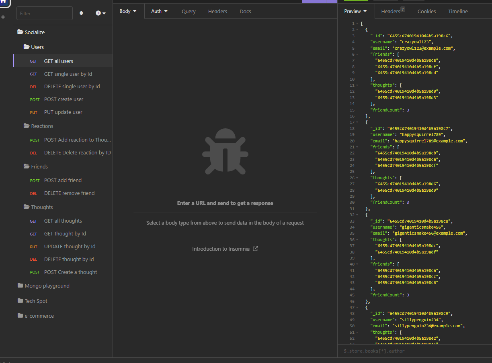
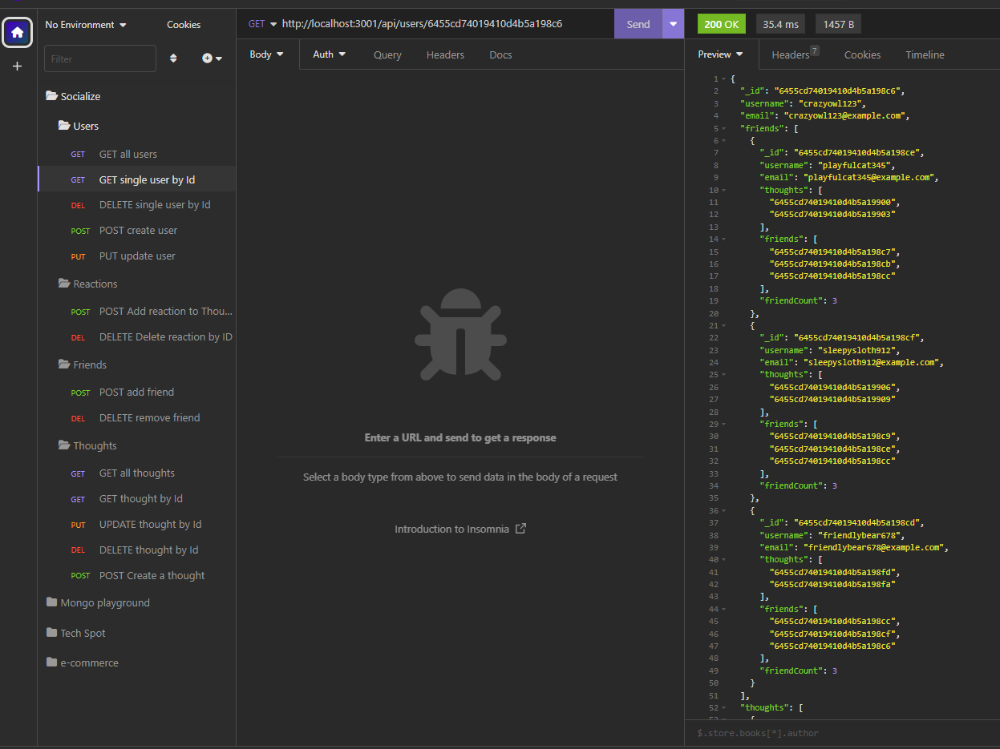
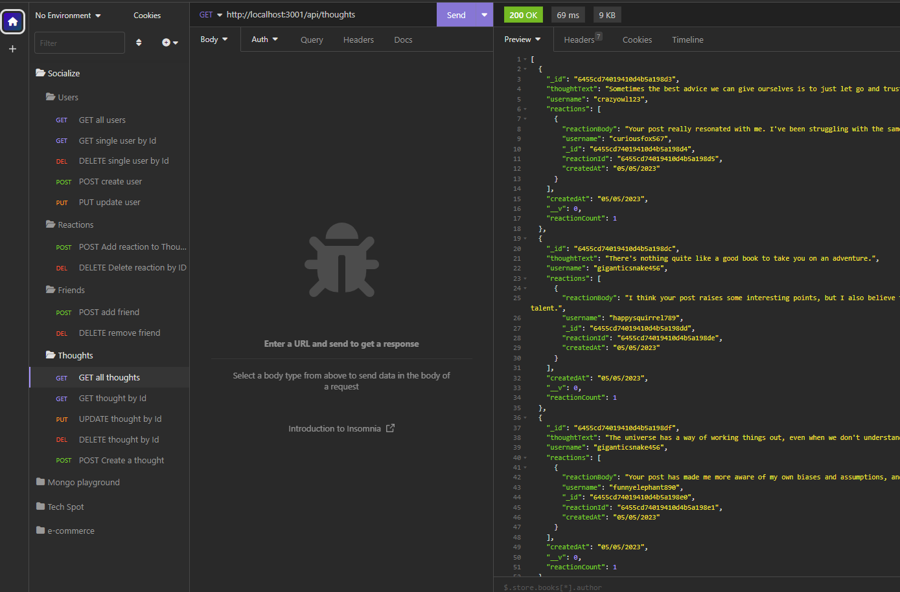

# Socialize Backend Framework

## Description

Socialize is a back end framwork that uses MongoDB, Mongoose ODM, Express, Node.js.
App uses API Routes to perform RESTful CRUD operations.

- [Socialize Backend Framework](#socialize-backend-framework)
  - [Description](#description)
  - [Installation](#installation)
    - [Walkthrough Video](#walkthrough-video)
    - [Link to GitHub Repo](#link-to-github-repo)
  - [Usage](#usage)
  - [Routes](#routes)
    - [USER Routes](#user-routes)
      - [DISPLAY / ADD User(s)](#display--add-users)
      - [ADD / DELETE Friends](#add--delete-friends)
    - [THOUGHT Routes](#thought-routes)
      - [DISPLAY / ADD Thought(s)](#display--add-thoughts)
      - [DISPLAY / UPDATE / DELETE by ID](#display--update--delete-by-id)
      - [ADD Reaction to Thought](#add-reaction-to-thought)
      - [DELETE Reaction from Thought](#delete-reaction-from-thought)
  - [Mock-up](#mock-up)
    - [API GET USERS](#api-get-users)
    - [API GET USER by ID](#api-get-user-by-id)
    - [API GET THOUGHTS](#api-get-thoughts)
  - [Contributors](#contributors)
  - [License:](#license)
    - [MIT License](#mit-license)
  - [Questions](#questions)
    - [GitHub](#github)
    - [e-mail](#e-mail)

## Installation 

This app runs in node.js

### Walkthrough Video

[https://youtu.be/zb2k1GV_GLA](https://youtu.be/zb2k1GV_GLA)

### Link to GitHub Repo

[https://github.com/mnyzio/socialize](https://github.com/mnyzio/socialize)

## Usage
Users can use any platform similar to POSTMAN or INSOMNIA to test API Routes

## Routes
### USER Routes

#### DISPLAY / ADD User(s)
- /api/users                                        // Routes: GET, POST
- /api/users/:userId                                // Routes: GET, PUT, DELETE
#### ADD / DELETE Friends
- /api/users/:userId/friends/:friendId              // Routes: POST, DELETE
### THOUGHT Routes

#### DISPLAY / ADD Thought(s)
- /api/thoughts                                     // Routes: GET, POST
- /api/thoughts/:thoughtId                          // Routes: GET, PUT, DELETE
#### DISPLAY / UPDATE / DELETE by ID
- /api/thoughts/:thoughtId                          // Routes: GET, PUT, DELETE
#### ADD Reaction to Thought
- /api/thoughts/:thoughtId/reactions                // Routes: POST
#### DELETE Reaction from Thought 
- /api/thoughts/:thoughtId/reactions/:reactionId    // Routes: DELETE
  
## Mock-up

### API GET USERS 

### API GET USER by ID

### API GET THOUGHTS

## Contributors

Mirek Nyzio

## License:

### MIT License

## Questions

### GitHub

[www.github.com/mnyzio](www.github.com/mnyzio)

### e-mail

[m.nyzio@outlook.com](m.nyzio@outlook.com)